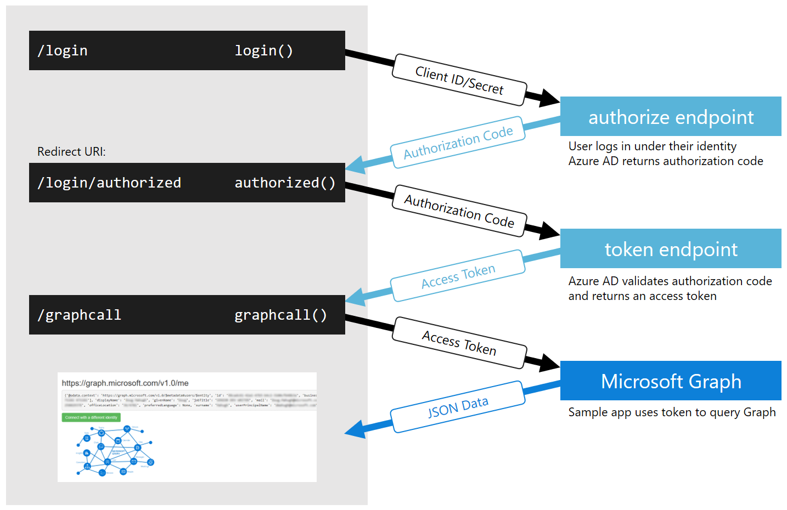
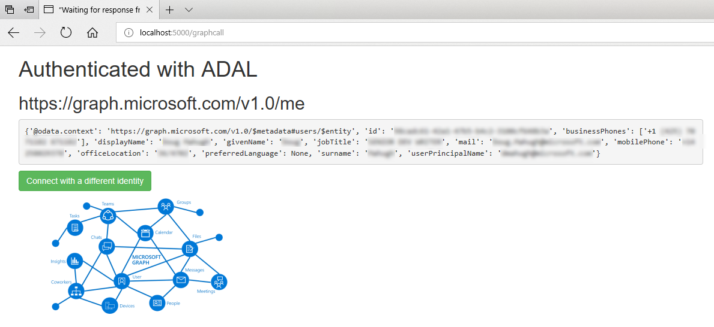

# Python authentication samples for Microsoft Graph

 

To make calls to [Microsoft Graph](https://developer.microsoft.com/en-us/graph/), your app must obtain a valid access token from Azure Active Directory (Azure AD), the Microsoft cloud identity service, and the token must be passed in an HTTP header with each call to the Microsoft Graph REST API. You can acquire access tokens via industry-standard [OAuth 2.0](https://tools.ietf.org/html/rfc6749) and [Open ID Connect](http://openid.net/connect/) protocols, and use an [Azure Active Directory v2.0 authentication library](https://docs.microsoft.com/en-us/azure/active-directory/develop/active-directory-v2-libraries) to implement those protocols.

This repo includes examples of four different approaches you can use to authenticate with Azure AD from a Python web application. Each sample implements the OAuth 2.0 [Authorization Code Grant](https://tools.ietf.org/html/rfc6749#section-4.1) workflow, which is the recommended approach for web applications written in Python.

* [Sample architecture](#sample-architecture)
* [Python auth options](#python-auth-options)
* [Running the samples](#running-the-samples)
* [Contributing](#contributing)
* [Resources](#resources)

## Sample architecture

The samples in this repo all do the same thing: prompt the user to log on, and then display their user profile data as JSON. All samples use the same names for variables, functions, and routes, and they also use the same HTML templates and CSS, to make it easy to see how the implementation details vary between different auth libraries.

The following diagram shows how each sample implements the Authorization Code Grant workflow.



Each ```sample_*.py``` source file has the same structure:

1. **initial setup** &mdash; Read configuration settings and instantiate auth provider.
2. **homepage()** &mdash; Static page with a /login button.
3. **login()** &mdash; Call auth provider to authenticate user, Azure AD returns authorization code.
4. **authorize()** (Redirect URI) &mdash; Use authorization code to request/save token, redirect to /graphcall.
5. **graphcall()** &mdash; Query Microsoft Graph and display returned data.

You can modify the samples to test specific Microsoft Graph calls you'd like to make by changing the endpoint, and changing the requested permissions to what that endpoint requires. For example, to retrieve your email messages instead of user profile data, change the ```/me``` endpoint to ```/me/messages``` and add ```Mail.Read``` to the list of permissions requested in the SCOPES setting of ```config.py```. With those changes, the sample will display a JSON document that contains the top ten messages from your mailbox.

Note that these samples are intended to clarify the minimum steps required for authenticating and making calls to Microsoft Graph. They don't include error handling and other common practices for production deployment.

## Python auth options

The following is a summary of the authentication options that the code samples in this repo demonstrate.

### Microsoft ADAL (sample_adal.py)

The [sample_adal.py](https://github.com/microsoftgraph/python-sample-auth/blob/master/sample_adal.py) sample shows how to use the [Microsoft Azure Active Directory Authentication Library (ADAL) for Python](https://github.com/AzureAD/azure-activedirectory-library-for-python) for authentication to Microsoft Graph. ADAL supports a variety of token acquisition methods and can be used for other Azure AD authentication scenarios in addition to working with Microsoft Graph. ADAL does not provide support for [Microsoft Accounts](https://account.microsoft.com/account/Account) or [incremental consent](https://docs.microsoft.com/en-us/azure/active-directory/develop/active-directory-v2-compare#incremental-and-dynamic-consent). If you need those capabilities, one of the other options might be a better fit.

In addition to [sample_adal.py](https://github.com/microsoftgraph/python-sample-auth/blob/master/sample_adal.py), which uses the Flask web framework, a [sample_adal_bottle.py](https://github.com/microsoftgraph/python-sample-auth/blob/master/sample_adal_bottle.py) version is provided, which uses the Bottle web framework.

### Flask-OAuthlib (sample_flask.py)

If you're building a [Flask](http://flask.pocoo.org/)-based web application, the [Flask-OAuthlib](https://flask-oauthlib.readthedocs.io/en/latest/) provides a simple way to authenticate with Azure AD for Microsoft Graph. The [sample_flask.py](https://github.com/microsoftgraph/python-sample-auth/blob/master/sample_flask.py) sample shows how to use Flask-OAuthlib to authenticate to Microsoft Graph.

### Request-OAuthlib (sample_requests.py)

If you're using [Requests](http://docs.python-requests.org/en/master/), the most popular HTTP library for Python developers, [Requests-OAuthlib](https://github.com/requests/requests-oauthlib) is a good option for Microsoft Graph authentication. The [sample_requests.py](https://github.com/microsoftgraph/python-sample-auth/blob/master/sample_requests.py) sample shows how to use Requests-OAuthlib to authenticate to Microsoft Graph from a Bottle web app.

### graphrest module (sample_graphrest.py)

If you're interested in developing your own authentication module, or are curious about the details of implementing OAuth 2.0 authentication for a web application, the [sample_graphrest.py](https://github.com/microsoftgraph/python-sample-auth/blob/master/sample_graphrest.py) sample provides an example of authenticating with [graphrest](https://github.com/microsoftgraph/python-sample-auth/blob/master/graphrest.py), a custom auth library written in Python. Note that this sample uses the [Bottle](https://bottlepy.org/docs/dev/) web framework, although it is relatively easy to port it to Flask or any other web framework that supports redirects and provides access to request query parameters.

## Running the samples

To install and configure the samples in this repo, see the instructions in [Installing the Python authentication samples](https://github.com/microsoftgraph/python-sample-auth/blob/master/installation.md). These samples only require the **User.Read** permission, which is the default, so you don't need to specify additional permissions while registering the application.

After you've completed those steps, follow these steps to run the samples:

1. To start a sample, run the command ```python <progname>``` in the root folder of the cloned repo. For example, to run the ADAL sample, use this command: ```python sample_adal.py```.

2. Go to this URL in a browser: [http://localhost:5000](http://localhost:5000). You should see a home page like this:

    

3. Choose **Connect**, and then select your Microsoft account or Office 365 account and follow the instructions to log on. The first time you log on to the app under a particular identity, you will be prompted to consent to the permissions that the app is requesting. Choose **Accept**, which gives the application permission to read your profile information. You'll then see the following screen, which shows that the app has successfully authenticated and is able to read your profile information from Microsoft Graph:



### Python package dependencies

The requirements.txt file for this repo includes all of the packages for all of the auth samples. If you only plan to use one of the samples, you may prefer to only install the packages required for that sample. The following table lists the Python package dependencies for each sample.

| Sample | Auth Library | Dependencies |
| ------ | ------------ | ------------ |
| [sample_adal.py](https://github.com/microsoftgraph/python-sample-auth/blob/master/sample_adal.py) | [Microsoft ADAL](https://github.com/AzureAD/azure-activedirectory-library-for-python) | <ul><li>adal</li><li>requests</li><li>flask</li></ul> |
| [sample_flask.py](https://github.com/microsoftgraph/python-sample-auth/blob/master/sample_flask.py) | [Flask-OAuthlib](https://flask-oauthlib.readthedocs.io/en/latest/) | <ul><li>flask</li><li>flask-oauthlib</li></ul> |
| [sample_requests.py](https://github.com/microsoftgraph/python-sample-auth/blob/master/sample_requests.py) | [Requests-OAuthlib](https://github.com/requests/requests-oauthlib) | <ul><li>requests</li><li>requests-oauthlib</li><li>bottle</li></ul> |
| [sample_graphrest.py](https://github.com/microsoftgraph/python-sample-auth/blob/master/sample_graphrest.py) | [graphrest module](https://github.com/microsoftgraph/python-sample-auth/blob/master/graphrest.py) | <ul><li>requests</li><li>bottle</li></ul> |

## Contributing

These samples are open source, released under the [MIT License](https://github.com/microsoftgraph/python-sample-auth/blob/master/LICENSE). Issues (including feature requests and/or questions about this sample) and [pull requests](https://github.com/microsoftgraph/python-sample-auth/pulls) are welcome. If there's another Python sample you'd like to see for Microsoft Graph, we're interested in that feedback as well &mdash; please log an [issue](https://github.com/microsoftgraph/python-sample-auth/issues) and let us know!

This project has adopted the [Microsoft Open Source Code of Conduct](https://opensource.microsoft.com/codeofconduct/). For more information, see the [Code of Conduct FAQ](https://opensource.microsoft.com/codeofconduct/faq/) or contact [opencode@microsoft.com](mailto:opencode@microsoft.com) with any additional questions or comments.

## Resources

Documentation:

* [Microsoft Graph Dev Center](https://developer.microsoft.com/en-us/graph/)
* [Get started with Microsoft Graph and REST](https://developer.microsoft.com/en-us/graph/docs/concepts/rest)
* [Get access tokens to call Microsoft Graph](https://developer.microsoft.com/en-us/graph/docs/concepts/auth_overview)
* [Authorize access to web applications using OAuth 2.0 and Azure Active Directory](https://docs.microsoft.com/en-us/azure/active-directory/develop/active-directory-protocols-oauth-code)

Samples:

* [Python authentication samples for Microsoft Graph](https://github.com/microsoftgraph/python-sample-auth)
* [Sending mail via Microsoft Graph from Python](https://github.com/microsoftgraph/python-sample-send-mail)
* [Working with paginated Microsoft Graph responses in Python](https://github.com/microsoftgraph/python-sample-pagination)
* [Working with Graph open extensions in Python](https://github.com/microsoftgraph/python-sample-open-extensions)
* [Python console application for Microsoft Graph](https://github.com/microsoftgraph/python-sample-console-app)

Auth libraries:

* [Microsoft ADAL for Python](https://github.com/AzureAD/azure-activedirectory-library-for-python)
* [Flask-Oauthlib](https://flask-oauthlib.readthedocs.io/en/latest/)
* [Requests-Oauthlib](https://media.readthedocs.org/pdf/requests-oauthlib/latest/requests-oauthlib.pdf)
* [Azure Active Directory v2.0 authentication libraries](https://docs.microsoft.com/en-us/azure/active-directory/develop/active-directory-v2-libraries)

Specifications:

* [Oauth 2.0 specification](http://www.rfc-editor.org/rfc/rfc6749.txt)
* [Open ID Connect specifications](http://openid.net/connect/)
